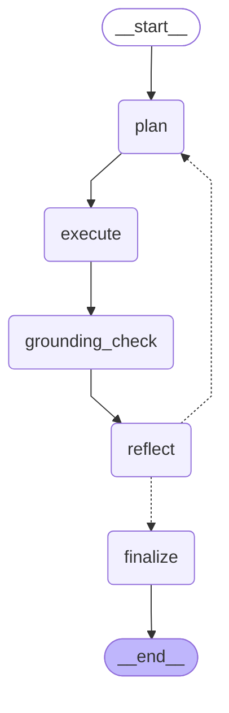

# Agent Graph

Auto-generated by `scripts/render_graph.py`. Do not edit by hand.

This is the compiled LangGraph agent used when `USE_LANGGRAPH=true`
is set in `.streamlit/secrets.toml`. See `src/agent_graph.py` for
node implementations and `README.md` for the overall routing stack.

## Node responsibilities

| Node | Purpose |
|---|---|
| `plan` | Call the Groq tool-calling planner (`src/planner.py`) and produce an ordered list of tool calls. |
| `execute` | Dispatch each tool call to the corresponding `_answer_*` handler in `streamlit_app.py`. |
| `grounding_check` | Extract any 10-digit NPI from the draft outputs and verify it exists in the targeting dataset. Flags hallucinations. |
| `reflect` | LLM-as-judge: if grounding failed OR a sub-question is missing, route back to `plan` for one retry. |
| `finalize` | Stitch outputs into the final markdown, appending a grounding warning if a hallucination remained after retries. |

## Diagram

