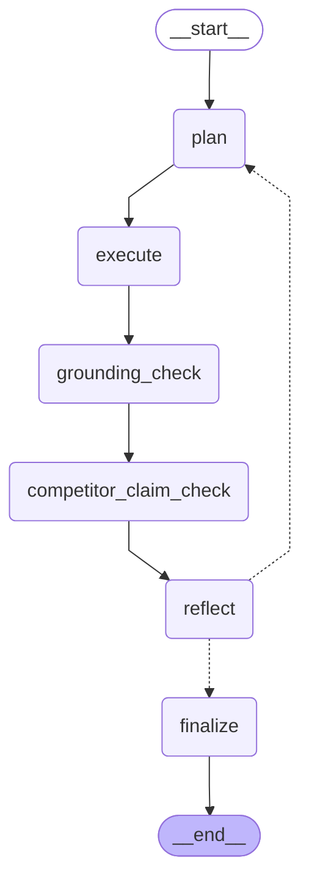

# Agent Graph

Auto-generated by `scripts/render_graph.py`. Do not edit by hand.

This is the compiled LangGraph agent used when `USE_LANGGRAPH=true`
is set in `.streamlit/secrets.toml`. See `src/agent_graph.py` for
node implementations and `README.md` for the overall routing stack.

The Streamlit UI renders each node's completion live via
`graph.stream(..., stream_mode="updates")` inside an `st.status`
panel, so users can watch the agent think step by step (and see
the reflect→plan retry loop when a guardrail triggers).

## Node responsibilities

| Node | Purpose |
|---|---|
| `plan` | Call the Groq tool-calling planner (`src/planner.py`) and produce an ordered list of tool calls. |
| `execute` | Dispatch each tool call to the corresponding `_answer_*` handler in `streamlit_app.py`. |
| `grounding_check` | Responsible-AI guardrail #1. Extract any 10-digit NPI from the draft outputs and verify it exists in the targeting dataset. Flags hallucinations. |
| `competitor_claim_check` | Responsible-AI guardrail #2. Uses LLM-as-judge to fact-check any specific, verifiable claim about a competitor drug (Opdivo / Tecentriq / Imfinzi / Libtayo) against the cached news body. Generic statements are ignored. |
| `reflect` | LLM-as-judge coverage gate. Routes back to `plan` for ≤1 retry if grounding failed, a competitor claim was unsupported, or a substantive sub-question was completely missed. |
| `finalize` | Stitch outputs into the final markdown, appending warning banners for any guardrail issues that survived the retry budget. |

## Diagram

